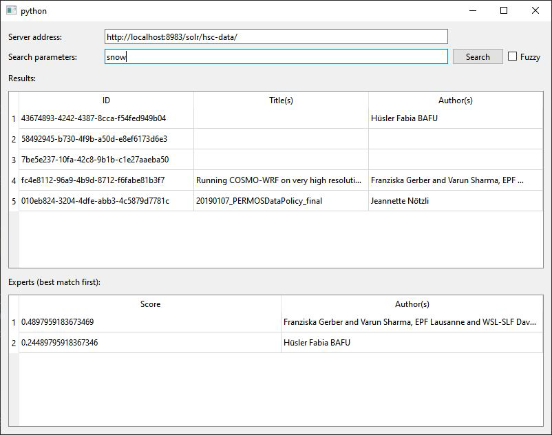

# Human_Smart_Cities: 

## Finding Files and Experts in Your Field: <br> How Solr Can Help

In-depth information can be found in our report under [Report/HumanSmartCitiesReport.pdf](./Report/HumanSmartCitiesReport.pdf)

### How to Set up Solr
Source: https://solr.apache.org/guide/8_10/solr-tutorial.html

If on Windows, from within the solr-8.10.1 directory, run the following command:  
`solr-8.10.0:$ ./bin/solr start -e cloud`  
If on Mac or Linux, download the [correct Solr distribution](https://solr.apache.org/downloads.html) and launch it from the downloaded directory.

Make sure to use port 8983 if you want to use the Python scripts in this repository.

Add a collection (best done when starting up) and name it 'HSC-Data'. 
The collection should use `sample_techproducts_configs` config, 
while the rest of the parameters can be left at default values.

Use pip (or similar) to install pySolr (e.g. `pip install pysolr`).  
Then you can use the python scripts to interact with solr. 

Once you're done, use `.\bin\solr stop -all` to stop all running solr instances

### Uploading Files
- In `pdf_uploader`, enter your collection (default is hsc-data) and let it run to upload all *.pdfs in repository_root/Data.

### Uploading Files Manually
- Open http://localhost:8983/solr.
- Navigate to the collection you wish to upload files in.
- Go to the entry "documents" under your collection, i.e. http://localhost:8983/solr/#/YOUR_COLLECTION/documents
- Change Request Handler to `/update/extract` and select Document Type "File Upload".
- Select the document to upload.
- If uploading a pdf, add the following Extracting Request Handler Parameter "literal.id" and enter a unique ID.
- Now click "Submit Document" and check that your document has been uploaded. 

### Launching the GUI to find keywords and experts
- To launch the GUI, go to scripts/gui/gui.py and launch the script.
- It should open a window, where one is able to enter a search term.
- Upon successful search, it will return matching documents with their ID, title (if within PDF metadata) and author (if within PDF metadata).
- Below, you will also see a list of experts with their scores.



### Querying data
- Appending `~` to the query, allows one to use the default error-tolerance of solr, which is 2 characters.

### Dropped Docker-compose setup
First install docker: <br/>
Windows: Install Docker Desktop and start it
Linux: 
```
sudo apt-get update
sudo apt-get install docker-ce docker-ce-cli containerd.io
```
Starting the container with:
```
solr/docker-compose up -d
```
Stopping the container with:
```
docker-compose stop
```

## Troubleshooting

### Deleting a collection
- ./bin/solr delete -c collection_name then restart with bin/solr restart -p 8983
- Alternatively, can be deleted in the web-interface.

#### Environmental variables
To start `solr` one has to set the environmental variable `JAVA_HOME` and `JRE_HOME`.
`JAVA_HOME` has for example the path (`C:\Program Files\Java\jdk-X.X.X`) and `JRE_HOME` the path (`C:\Program Files (x86)\java\jre1.x.x`).

#### Solr node is already running but can't stop solr
If the command `solr stop -all` or `solr.cmd stop -all` doesn't help we have to find the process id and stop the process with command line.<br /><br />
WINDOWS:<br />
Find process id on port 8983
```
netstat -ano | find "8983"
```
which gives for example:<br />
```
TCP 0.0.0.0:8983    0.0.0.0:0   LISTENING   10896
```
the last value in the row is the process id, which can be used to kill the process with the following command:
```
taskkill /F /pid 10896
```
